<!-- TODO : use smaller (lighter) images -->
<!-- TODO : make back button return the prior section -->
<!-- TODO : make back and forward work -->

### PIV/PLIF

<a href="pages/publpics/vorticity.html">
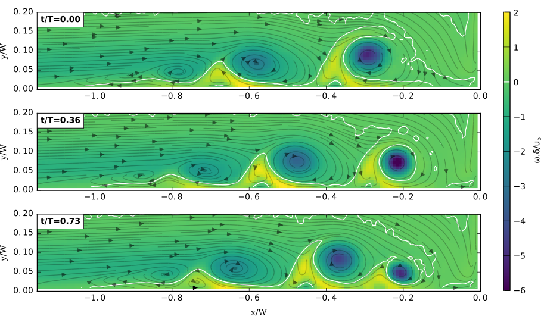
</a>

<a href="pages/publpics/test_torrentiel.html">
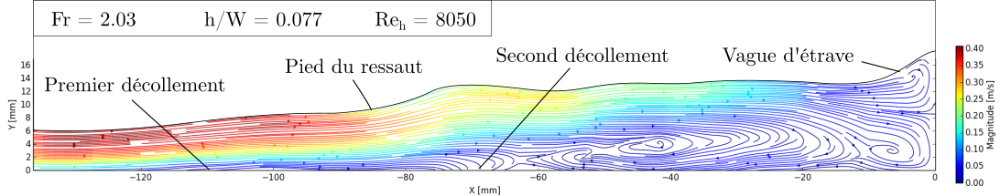
</a>

### Flow dynamics

<a href="pages/publpics/M111_L040_vfreq_hsv.html">
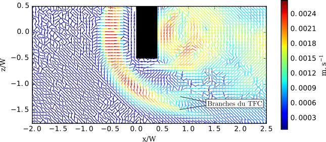
</a>

### Vortex detection

<a href="pages/publpics/POFM_suivi_vortex.html">
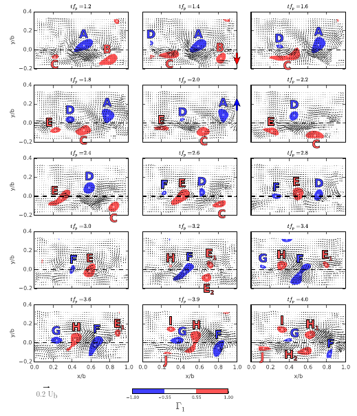
</a>

<a href="pages/publpics/complex-col.html">
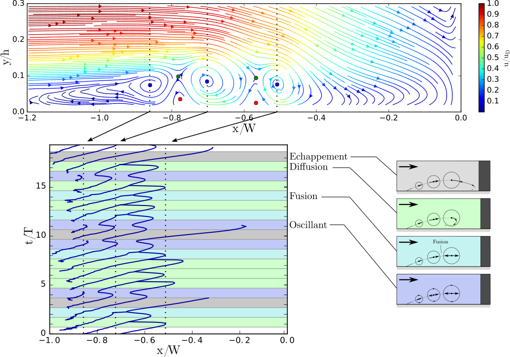
</a>

<a href="pages/publpics/POFM_density_map.html">
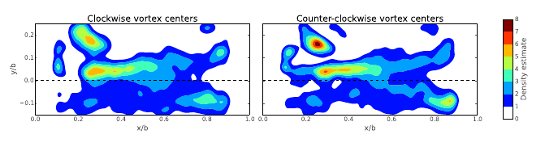
</a>

<a href="pages/publpics/vort_properties_evol.html">
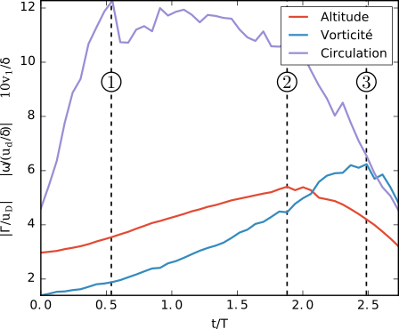
</a>

### Flow topology

<a href="pages/publpics/DETECT_sadd_ori.html">
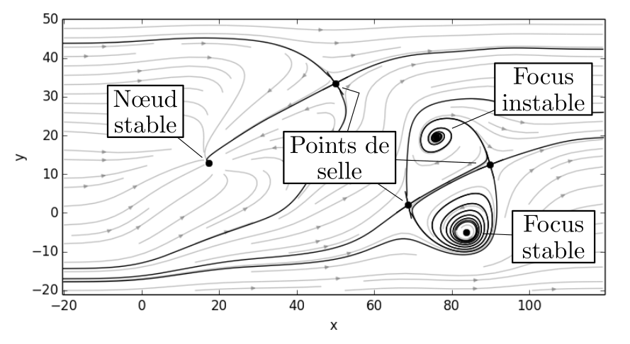
</a>

<a href="pages/publpics/NL_crit_exemple.html">
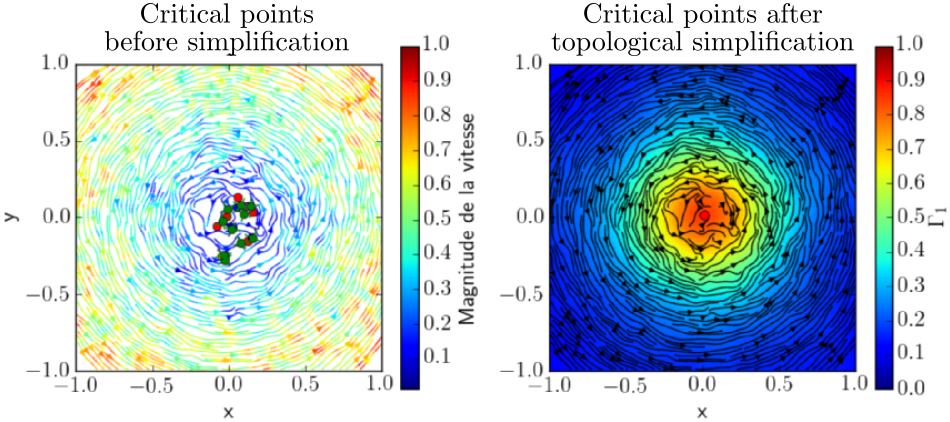
</a>

### Modelisation

<a href="pages/publpics/Simulations.html">
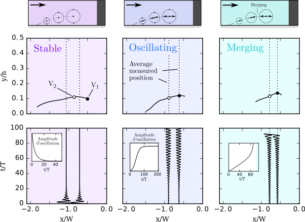
</a>

### Flow around obstacles

<a href="pages/publpics/schema_manip.html">
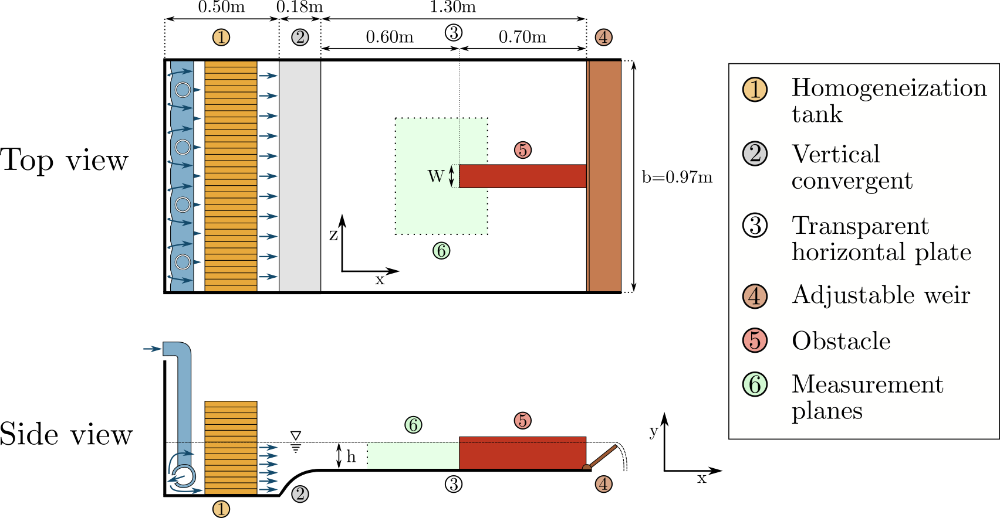
</a>

<a href="pages/publpics/vortex_superieur.html">
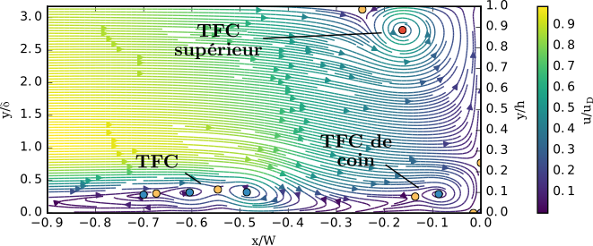
</a>

### Non-linear dynamics

<a href="pages/publpics/attracteur_2_5p.html">
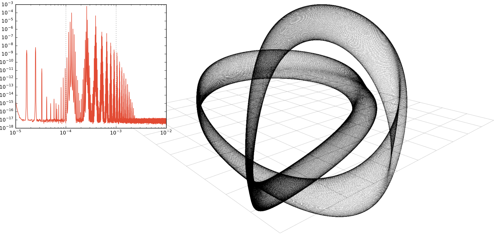
</a>

<a href="pages/publpics/attracteur_2_3p.html">
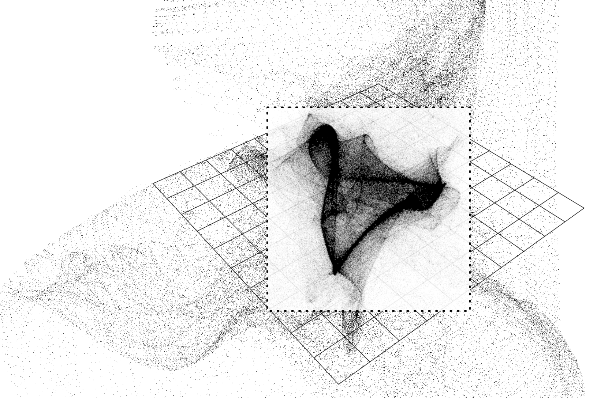
</a>

<a href="pages/publpics/poinc_attract_2_3p_pos1_u.html">
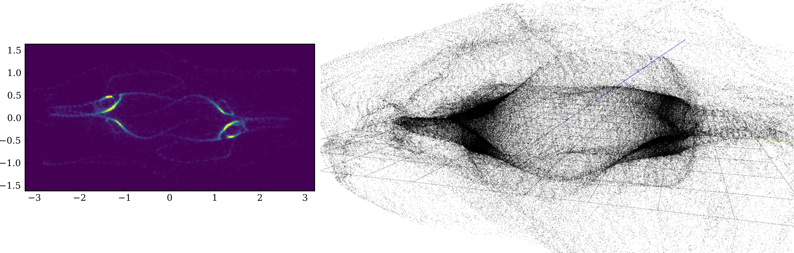
</a>

### POD

<!-- TODO : Add POD -->

<!-- 
 -->
<!--   
 -->
<!--       <ul class="nav"> -->
<!--           <li><a href="morefigs.html">see more figures</a></li> -->
<!--       </ul> -->
<!--   
 -->
<!-- 
 -->
