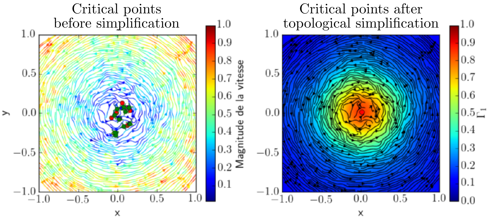

  

      <ul class="nav">
        <li><a href="../../index.html#flow-topology">back</a></li>
          <li><a href="DETECT_sadd_ori.html">prev</a></li>
          <li><a href="Simulations.html">next</a></li>
      </ul>
  

**Figure 9**.
title: Illustration of the use of non-local criterion for vortex detection
