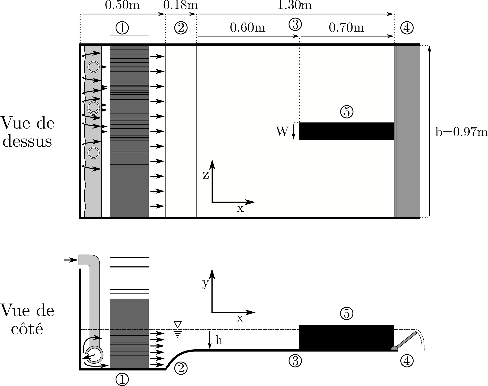

  

      <ul class="nav">
        <li><a href="../../index.html#flow-around-obstacles">back</a></li>
          <li><a href="Simulations.html">prev</a></li>
          <li><a href="vortex_superieur.html">next</a></li>
      </ul>
  

**Figure 11**.
Experimental device diagram used to create ans measure HSV around long obstacles emerging from a laminar free-surface.
